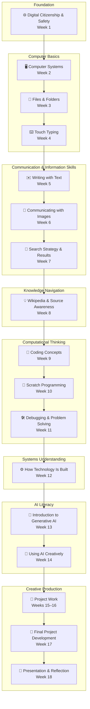
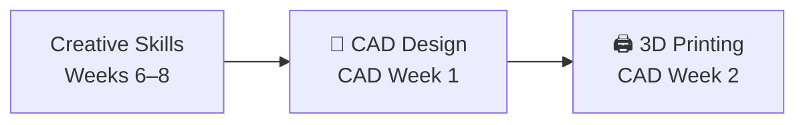

# 18-Week Computer Literacy Curriculum

This curriculum provides a **structured introduction to computer literacy** for young beginners (roughly ages 8–12, with adult guidance as needed). It blends guided instruction with independent exploration to help learners develop confidence using computers for **communication, creativity, problem solving, and digital citizenship**.

The program works in **classrooms, homeschool settings, libraries, and after-school programs** — anywhere an adult can guide a young learner through hands-on exploration. It progresses from **basic computer interaction** toward **creative digital projects**, gradually introducing concepts like coding, media creation, information literacy, and generative AI.

Lessons are intentionally **hands-on, interest-driven, and flexible**, allowing the facilitator to adapt activities based on the learner’s curiosity and pace while still pushing students to **analyze, evaluate, and create**.

For detailed setup guidance, pacing options, and environment tips, see [How to Use This Curriculum](./how-to-use-this-curriculum.md).

Use this roadmap image when you want a quick visual summary of how the full sequence fits together before reading the detailed weekly breakdown.

---

:::tip Use This Page
- Review [Curriculum Overview](#curriculum-overview) for pacing and facilitation assumptions.
- Use [Program at a Glance](#program-at-a-glance) to jump to a specific week quickly.
- Check [Optional CAD Extension](#optional-cad-extension) for the bonus 3D design track.
- Open [Learning Ladder: How Skills Build Over Time](#learning-ladder-how-skills-build-over-time) to see how the course connects.
- Save [Independent Session Setup Tips](#independent-session-setup-tips) for logistics.
- See [Assessment & Progress](./assessment-and-progress.md) and [Tool Alternatives](./tool-alternatives.md) for additional planning support.
:::

:::info Planning Help
- Use this page as your roadmap before the course starts or whenever you need to find the right lesson quickly.
- The week-by-week table is the fastest way to jump into a lesson page.
- If you are planning lighter weeks, the optional CAD extension can stay separate from the main 18-week sequence.
- For accessibility and adaptation guidance, see [Adaptations & Accessibility](./adaptations-and-accessibility.md).
:::

## Curriculum Overview

### Target Audience
Young beginner computer users (roughly ages 8–12).  
Basic reading ability is helpful, but adult guidance is expected.

### Weekly Structure
Each week contains:

- **Two guided sessions** (about 30 minutes each)
- **One independent session** (about 20 minutes)

Guided sessions introduce concepts and tools.  
Independent sessions reinforce skills through creative exploration, reflection, and purposeful revision.

Across the curriculum, students are regularly asked to explain what they notice, compare possible choices, judge what works best, and create stronger next versions of their work.

### Typing Practice
Beginning **Week 4**, incorporate **5–10 minutes of typing practice** during guided sessions.

Recommended tools:

- [TypingClub](https://www.typingclub.com/)
- [BBC Dance Mat Typing](https://www.bbc.co.uk/bitesize/topics/zf2f9j6/articles/z3c6tfr)

The goal is **comfort and muscle memory**, not speed.

### Final Project

The program culminates in a **Digital Creation Story project** developed during Weeks **15–18**.

Students combine multiple skills learned throughout the curriculum such as:

- writing
- drawing
- coding
- video creation
- design
- storytelling

The final format is flexible and may include:

- Scratch animation
- slideshow story
- simple video
- interactive project
- digital artwork presentation

### Assessment Approach

Assessment in this curriculum is **observation-based and low-pressure**. Rather than tests or grades, facilitators track progress by watching what students can do, listening to how they explain their thinking, and reviewing the artifacts they create.

Each week includes natural checkpoints — reflection questions, show-and-tell moments, and creative outputs — that make learning visible without adding stress.

For a complete guide to tracking progress, see [Assessment & Progress](./assessment-and-progress.md). For the final project specifically, see the [Final Project Rubric](./final-project-rubric.md).

### Digital Portfolio

Throughout the course, students build a **digital portfolio** — a growing collection of their saved work, creative projects, and reflections. This begins with the **Personal Project Folder** introduced in Week 3 and expands each week as students add new artifacts.

The portfolio serves multiple purposes:

- It gives learners a **visible record of growth** they can look back on with pride
- It provides facilitators with **concrete evidence of progress** without formal testing
- It creates a natural foundation for the **final project showcase** in Week 18

### Digital Citizenship Theme

The curriculum repeatedly reinforces the key safety message:

> **“When in Doubt, Talk It Out.”**

Students are encouraged to speak with a trusted adult whenever something online feels confusing or uncomfortable.

### Flexibility & Adaptability

This curriculum is a **guide, not a rigid script**.

Adjust pacing based on the learner’s:

- engagement
- confidence
- curiosity
- attention span

If a concept is mastered quickly, explore optional challenges.  
If a topic feels difficult, slow down and revisit it through play or discussion.

The curriculum suggests specific tools (like Scratch, TinkerCAD, and Google Slides), but most activities can be completed with alternatives. See [Tool Alternatives](./tool-alternatives.md) for platform-flexible options.

The ultimate goal is **confidence and curiosity**, not rushing through content.

---

## Program at a Glance

Each week below links to a detailed lesson page containing:

- learning objectives
- guided sessions
- independent activities
- preparation notes

| Week | Theme | Focus Highlights |
|---|---|---|
| [Week 1](./week01-week-1-internet-playground) | 🌐 Welcome to the Digital World | Internet basics, digital citizenship, online safety |
| [Week 2](./week02-week-2-computer-control-room) | 🖥️ How Computers Work | Inputs, outputs, windows, apps, and basic interactions |
| [Week 3](./week03-week-3-digital-treasure-chest) | 📁 Organizing the Digital World | Files, folders, saving work, digital ownership |
| [Week 4](./week04-week-4-keyboard-ninja-training) | ⌨️ Keyboard Skills | Touch typing basics and keyboard confidence |
| [Week 5](./week05-week-5-the-power-of-words) | ✉️ Writing on Computers | Text communication and simple writing tools |
| [Week 6](./week06-week-6-the-digital-art-studio) | 🎨 Pictures Tell Stories | Digital drawing and image communication |
| [Week 7](./week07-week-7-the-internet-detective-lab) | 🔎 Smart Searching | Better questions, search terms, search results, and choosing what to open |
| [Week 8](./week08-week-8-the-idea-workshop) | 💡 The Idea Workshop | Wikipedia exploration, connected knowledge, references, and source awareness |
| [Week 9](./week09-week-9-teach-the-computer) | 🧠 Thinking Like a Programmer | Algorithms, logic, and coding concepts |
| [Week 10](./week10-week-10-build-your-first-program) | 🧩 Coding with Blocks | Scratch programming and interactive logic |
| [Week 11](./week11-week-11-the-debugging-lab) | 🛠 Fixing Digital Problems | Debugging and troubleshooting |
| [Week 12](./week12-week-12-how-things-are-built) | ⚙️ How Digital Systems Work | Understanding digital and physical systems |
| [Week 13](./week13-week-13-AI-discovery-lab) | 🤖 Meet AI | What generative AI is and how it works |
| [Week 14](./week14-week-14-AI-creative-partner) | 🎨 AI as a Creative Tool | Using AI for ideas, images, and storytelling |
| [Week 15](./week15-week-15-invent-something-cool) | 🚀 Project Creation | Beginning the final project |
| [Week 16](./week16-week-16-build-and-improve) | 🔧 Building the Project | Developing and improving the project |
| [Week 17](./week17-week-17-final-touches) | 🧪 Final Development | Testing and finishing the project |
| [Week 18](./week18-week-18-creator-showcase) | 🎉 Project Showcase | Presentation and reflection |

---

## Optional CAD Extension

If the learner is interested in **3D design or 3D printing**, the following optional modules can be added after the main curriculum.

| Week | Theme | Focus Highlights |
|---|---|---|
| [CAD Week 1](./week-CAD-1-shape-builders) | 🧊 Building in 3D | Learning TinkerCAD, shapes, and spatial thinking |
| [CAD Week 2](./week-CAD-2-from-screen-to-real-objects) | 🖨 From Screen to Real Object | Preparing designs for 3D printing |

These modules introduce:

- spatial reasoning
- CAD modeling concepts
- real-world fabrication workflows

---

## Learning Ladder: How Skills Build Over Time

Each layer of the curriculum builds on the previous one.  
Students begin by learning how computers work and how to stay safe online, then move into communication, information literacy, coding, and finally producing a complete digital project.

---

---

# How to Read the Roadmap

This diagram shows the **learning journey** across the course.

Students move through stages:

Digital Safety
↓
Computer Basics
↓
Communication
↓
Information Literacy
↓
Coding & Logic
↓
Systems Thinking
↓
AI Literacy
↓
Creative Project
↓
Presentation

Each step builds the foundation for the next.

By the time students reach the final project, they have practiced:

- digital citizenship  
- computer navigation  
- file organization  
- typing  
- digital communication  
- searching, comparing results, and tracing information back to sources  
- coding logic  
- debugging and problem solving  
- creative digital tools  
- AI-assisted creativity  

---

# Optional CAD Path (Extension)

You can optionally show the CAD path branching from the creative stage:

The curriculum is designed to move students from **digital awareness → digital fluency → digital creativity**.

By the end of the course, students are not just using computers — they are **building with them**.

## Independent Session Setup Tips

Independent sessions work best when the learner has **clear visual instructions and a structured environment**.

Helpful strategies:

**1. Visual instruction cards**  
Provide simple step-by-step guidance with icons or pictures.

**2. Visual timer**  
A countdown timer helps learners manage the 20-minute session independently.

**3. A simple “Help Card”**  
Include common troubleshooting reminders such as:

- Try clicking again
- Check if the program is already open
- Try closing and reopening
- Ask an adult if you're stuck

**4. Achievement tracker**  
A themed progress chart with stickers or checkmarks can make progress visible and motivating.

**5. Weekly show-and-tell**  
After each independent session, spend 1–2 minutes letting the learner explain what they created.

---

## Materials for Independent Sessions

Helpful materials to prepare ahead of time:

- Printed visual instruction cards
- Troubleshooting “Help Card”
- Achievement chart and stickers
- Starter templates when appropriate
- Tool reference sheets for programs like:
  - Paint / Paint 3D
  - Scratch
  - TinkerCAD
  - Slides or Clipchamp

---

## Final Notes

This curriculum is designed to introduce children to **computing as a creative and empowering tool** — whether used in a classroom, at home, in a library, or in an after-school program.

By the end of the program, students will have experience with:

- digital citizenship
- computer navigation
- file organization
- typing
- digital communication
- creative media tools
- programming concepts
- generative AI
- project-based creation

They will also have a **digital portfolio** of work they created and improved over the course — a tangible record of their growth.

Most importantly, they will build **confidence exploring technology and expressing ideas digitally**.

**Facilitator resources:**

- [How to Use This Curriculum](./how-to-use-this-curriculum.md) — setup, pacing, and environment guidance
- [Assessment & Progress](./assessment-and-progress.md) — observation-based tracking
- [Adaptations & Accessibility](./adaptations-and-accessibility.md) — support for diverse learners
- [Tool Alternatives](./tool-alternatives.md) — flexible software options
- [Final Project Rubric](./final-project-rubric.md) — capstone evaluation guide